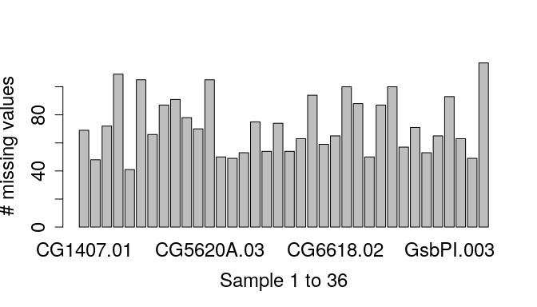
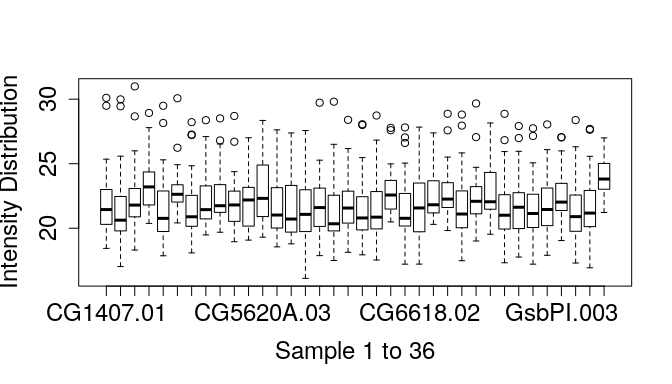
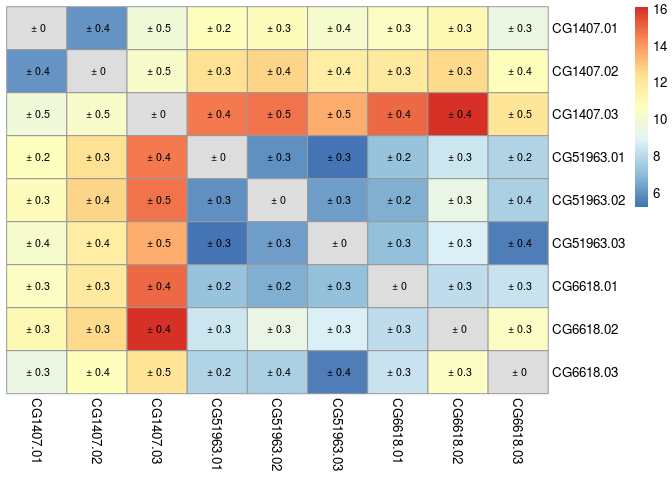
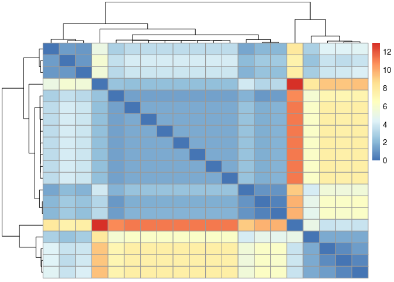

<!-- README.md is generated from README.Rmd. Please edit that file -->
proDA
=====

<!-- badges: start -->
<!-- badges: end -->
The goal of `proDA` is to identify differentially abundant proteins in label-free mass spectrometry data. The main challenge of this data are the many missing values. The missing values don't occur randomly but especially at low intensities. This means that they cannot just be ignored. Existing methods have mostly focused on replacing the missing values with some reasonable number ("imputation") and then run classical methods. But imputation is problematic because it obscures the amount of available information. Which in turn can lead to over-confident predictions.

`proDA` on the other hand does not impute missing values, but constructs a probabilistic dropout model. For each sample it fits a sigmoidal dropout curve. This information can then be used to infer means across samples and the associated uncertainty, without the intermediate imputation step. `proDA` supports full linear models with variance and location moderation.

Installation
------------

You can install the development version from [GitHub](https://github.com/const-ae/proDA) with:

``` r
# install.packages("devtools")
devtools::install_github("const-ae/proDA")
```

The pkgdown documentation for the package is available on <https://const-ae.github.io/proDA/reference>

In the following section, I will give a very brief overview on the main functionality of the `proDA` package. New users are advised to directly go to section two, where I give a complete walkthrough and explain in detail, what steps are necessary for the analysis of label-free mass spectrometry data.

Quickstart
----------

The three steps that are necessary to analyze the data are

1.  Load the data (see vignette on loading MaxQuant output files)
2.  Fit the probabilistic dropout model (`proDA()`)
3.  Test in which proteins the coefficients of the model differ (`test_diff()`)

``` r
# Load the package
library(proDA)
# Generate some dataset with known structure
syn_dataset <- generate_synthetic_data(n_proteins = 100, n_conditions = 2)

# The abundance matrix
syn_dataset$Y[1:5, ]
#>           Condition_1-1 Condition_1-2 Condition_1-3 Condition_2-1 Condition_2-2 Condition_2-3
#> protein_1      18.84931      19.06662      19.03464            NA      18.93679      19.73022
#> protein_2      20.75887      20.61900      20.33392      20.59803      20.81937      20.72472
#> protein_3            NA      18.61271      18.96289            NA      19.56371      19.32429
#> protein_4      25.62239      24.91191      25.47405      25.09780      24.42479      24.47261
#> protein_5      23.60771      22.89148      23.02004      23.21011      23.12756      23.86721

# Assign the samples to the two conditions
syn_dataset$groups
#> [1] Condition_1 Condition_1 Condition_1 Condition_2 Condition_2 Condition_2
#> Levels: Condition_1 Condition_2

# Fit the probabilistic dropout model
fit <- proDA(syn_dataset$Y, design = syn_dataset$groups)

# Identify which proteins differ between Condition 1 and 2
test_diff(fit, `Condition_1` - `Condition_2`, sort_by = "pval", n_max = 5)
#> # A tibble: 5 x 10
#>   name               pval  adj_pval  diff t_statistic    se    df avg_abundance n_approx n_obs
#>   <chr>             <dbl>     <dbl> <dbl>       <dbl> <dbl> <dbl>         <dbl>    <dbl> <dbl>
#> 1 protein_95  0.000000903 0.0000903 -5.03       -18.5 0.272  6.36          21.3     6.       6
#> 2 protein_98  0.00000620  0.000310   4.36        13.6 0.321  6.36          21.8     6.       6
#> 3 protein_96  0.0000153   0.000509   8.47        20.1 0.422  4.46          22.4     4.10     4
#> 4 protein_100 0.000117    0.00294    3.05        10.3 0.296  5.19          21.3     4.83     5
#> 5 protein_91  0.000158    0.00316   -4.25       -11.8 0.359  4.45          19.2     4.09     4
```

Other helpful functions for quality control are `median_normalization()` and `dist_approx()`.

proDA Walkthrough
-----------------

`proDA` is an R package that implements a powerful probabilistic dropout model to identify differentially abundant proteins. The package was designed specifically with label-free mass spectrometry data in mind, which poses the challenge of many missing values.

But all this is useless if you cannot load your data and get it into a shape that is useable. In the next section, I will give an example how to load the abundance matrix and bring it into a useful form. The steps that I will go through are

1.  Load the `proteinGroups.txt` MaxQuant output table
2.  Extract the intensity columns and create the abundance matrix
3.  Replace the zeros with `NA`s and take the `log2()` of the data
4.  Normalize the data using `median_normalization()`
5.  Inspect sample structure with a heatmap of the distance matrix (`dist_approx()`)
6.  Fit the probabilisitc dropout model with `proDA()`
7.  Identify differentially abundant proteins with `test_diff()`

### Load Data

I will now demonstrate how to load a MaxQuant output file. For more information about other approaches for loading the data, please take a look at the vignette on loading data.

MaxQuant is one of the most popular tools for handling raw MS data. It produces a number of files. The important file that contains the protein intensities is called `proteinGroups.txt`. It is a large table with detailed information about the identification and quantification process for each protein group (which I will from now on just call "protein").

This package comes with an example `proteinGroups.txt` file, located in the package folder. The file contains the reduced output from an experiment studying the different DHHCs in Drosophila melanogaster.

``` r
system.file("extdata/proteinGroups.txt", package = "proDA", mustWork = TRUE)
#> [1] "/home/constantin/R/x86_64-pc-linux-gnu-library/3.6/proDA/extdata/proteinGroups.txt"
```

In this example, I will use the base R functions to load the data, because they don't require any additional dependencies.

``` r
# Load the table into memory
maxquant_protein_table <- read.delim(
    system.file("extdata/proteinGroups.txt", package = "proDA", mustWork = TRUE),
    stringsAsFactors = FALSE
)
```

As I have mentioned, the table contains a lot of information (359 columns!!), but we are first of all interested in the columns which contain the measured intensities.

``` r
# I use a regular expression (regex) to select the intensity columns
intensity_colnames <- colnames(maxquant_protein_table)[grepl("^LFQ\\.intensity\\.",
                                                             colnames(maxquant_protein_table))]
head(intensity_colnames)
#> [1] "LFQ.intensity.CG1407.01" "LFQ.intensity.CG1407.02" "LFQ.intensity.CG1407.03"
#> [4] "LFQ.intensity.CG4676.01" "LFQ.intensity.CG4676.02" "LFQ.intensity.CG4676.03"


# Create the intensity matrix
abundance_matrix <- as.matrix(maxquant_protein_table[, intensity_colnames])
# Adapt column and row maxquant_protein_table
colnames(abundance_matrix) <- sub("^LFQ\\.intensity\\.", "", intensity_colnames)
rownames(abundance_matrix) <- maxquant_protein_table$Protein.IDs
# Print some rows of the matrix with short names so they fit on the screen
abundance_matrix[46:48, 1:6]
#>                                       CG1407.01 CG1407.02 CG1407.03 CG4676.01 CG4676.02 CG4676.03
#> A0A0B4K6W1;P08970                        713400    845440         0         0   1032600         0
#> A0A0B4K6W2;A0A0B4K7S0;P55824-3;P55824   5018800   4429500   2667200         0   8780200   1395800
#> A0A0B4K6X7;A1Z8J0                             0         0         0         0         0         0
```

After extracting the bits from the table we most care about, we will have to modify it.

Firstly, MaxQuant codes missing values as `0`. This is misleading, because the actual abundance probably was not zero, but just some value too small to be detected by the mass spectrometer. Accordingly, I will replace all `0` with `NA`.

Secondly, the raw intensity values have a linear mean-variance relation. This is undesirable, because a change of `x` units can be a large shift if the mean is small or irrelevant if the mean is large. Luckily, to make the mean and variance independent, we can just `log` the intensities. Now a change of `x` units is as significant for highly abundant proteins, as it is for low abundant ones.

``` r
abundance_matrix[abundance_matrix == 0] <- NA
abundance_matrix <- log2(abundance_matrix)
abundance_matrix[46:48, 1:6]
#>                                       CG1407.01 CG1407.02 CG1407.03 CG4676.01 CG4676.02 CG4676.03
#> A0A0B4K6W1;P08970                      19.44435  19.68934        NA        NA  19.97785        NA
#> A0A0B4K6W2;A0A0B4K7S0;P55824-3;P55824  22.25891  22.07871  21.34689        NA  23.06582  20.41266
#> A0A0B4K6X7;A1Z8J0                            NA        NA        NA        NA        NA        NA
```

### Quality Control

Quality control (QC) is essential for a successful bioinformatics analysis, because any dataset shows some unwanted variation or could even contain more serious error like for example a sample swap.

Often we start with normalizing the data to remove potential sample specific effects. But already this step is challenging, because the missing values cannot easily be corrected for. Thus, a first helpful plot is to look how many missing values are in each sample.

``` r

barplot(colSums(is.na(abundance_matrix)),
        ylab = "# missing values",
        xlab = "Sample 1 to 36")
```



We can see that the number of missing values differs substantially between samples (between 30% and 90%) in this dataset. If we take a look at the intensity distribution for each sample, we see that they differ substantially as well.

``` r
boxplot(abundance_matrix,
        ylab = "Intensity Distribution",
        xlab = "Sample 1 to 36")
```



Note that, the intensity distribution is shifted upwards for samples which also have a large number of missing values (for example the last one). This agrees with our idea that small values are more likely to be missing. On the other hand, this also demonstrates why normalization methods such as quantile normalization, which distort the data until all the distributions are equal, are problematic. I will apply the more "conservative" median normalization, which ignores the missing values and transforms the values so that the median difference between the sample and average across all other samples is zero.

``` r
normalized_abundance_matrix <- median_normalization(abundance_matrix)
```

An important tool to identify sample swaps and outliers in the dataset is to look at the sample distance matrix. It shows the distances of samples A to B, A to C, B to C and so on.

The base R `dist()` function can not handle input data that contains missing values, so we might be tempted to just replace the missing values with some other and calculate the distance on the completed dataset. But choosing a good replacement value is challenging and can also be misleading because the samples with many missing values would be considered too close.

Instead `proDA` provides the `dist_approx()` function that takes either a fitted model (ie. the output from `proDA()`) or a simple matrix (for which it internally calls `proDA()`) and estimates the expected distance without imputing the missing values. In addition, it reports the associated uncertainty with every estimate. The estimates for samples with many missing values will be uncertain, allowing the data analyst to discount them.

``` r
da <- dist_approx(normalized_abundance_matrix)
```

`dist_approx()` returns two elements the `mean` of the estimate and the associated `sd`. In the next step I will plot the heatmap for three differnet conditions, adding the 95% confidence interval as text to each cell.

``` r
# This chunk only works if pheatmap is installed
# install.packages("pheatmap")
sel <- c(1:3,  # CG1407
         7:9,  # CG59163
         22:24)# Cg6618

plot_mat <- as.matrix(da$mean)[sel, sel]
plot_mat[diag(9) == 1] <- NA
uncertainty <- matrix(paste0(" ± ",round(as.matrix(da$sd * 1.96)[sel, sel], 1)), nrow=9)
pheatmap::pheatmap(plot_mat, 
                   cluster_rows = FALSE, cluster_cols = FALSE,
                   display_numbers= uncertainty,
                   number_color = "black")
```



### Fit the Probabilistic Dropout Model

In the next step, we will fit the actual linear probabilistic dropoout model to the normalized data. But before we start, I will create a data.frame that contains some additional information on each sample, in particular to which condition that sample belongs.

``` r

sample_info_df <- data.frame(name = colnames(normalized_abundance_matrix),
                             stringsAsFactors = FALSE)
sample_info_df$condition <- substr(sample_info_df$name, 1, nchar(sample_info_df$name)  - 3)
sample_info_df$replicate <- as.numeric(
  substr(sample_info_df$name, nchar(sample_info_df$name)  - 1, 20)
)
sample_info_df
#> # A tibble: 36 x 3
#>    name       condition replicate
#>    <chr>      <chr>         <dbl>
#>  1 CG1407.01  CG1407            1
#>  2 CG1407.02  CG1407            2
#>  3 CG1407.03  CG1407            3
#>  4 CG4676.01  CG4676            1
#>  5 CG4676.02  CG4676            2
#>  6 CG4676.03  CG4676            3
#>  7 CG51963.01 CG51963           1
#>  8 CG51963.02 CG51963           2
#>  9 CG51963.03 CG51963           3
#> 10 CG5620A.01 CG5620A           1
#> # … with 26 more rows
```

Now we can call the `proDA()` function to actually fit the model. We specify the `design` using the formula notation, referencing the `condition` column in the `sample_info_df` data.frame that we have just created. In addition, I specify that I want to use the `S2R` condition as the reference because I know that it was the negative control and this way automatically all coefficients measure how much each condition differs from the negative control.

``` r
fit <- proDA(normalized_abundance_matrix, design = ~ condition, 
             col_data = sample_info_df, reference_level = "S2R")
fit
#>  Parameters of the probabilistic dropout model
#> 
#> The dataset contains 36 samples and 122 proteins
#> 59.7% of the values are missing
#> 
#> Experimental design: y~condition
#> The model has successfully converged.
#> 
#> The inferred parameters are:
#> location_prior_mean:     19.3
#> location_prior_scale:    9.6
#> location_prior_df:       3
#> variance_prior_scale:    0.315
#> variance_prior_df:       1.11
#> dropout_curve_position:  19.6, 18, 19.8, 24.3, ...
#> dropout_curve_scale:     -1.17, -0.661, -1.3, -2.44, ...
```

The `proDAFit` object prints a number of useful information about the convergence of the model, the size of the dataset, the number of missing values, and the inferred hyper parameters.

To make it easy to find available methods on the `proDAFit` object, the `$`-operator is overloaded and shows a list of possible functions:


``` r
# Equivalent to feature_parameters(fit)
fit$feature_parameters
#> # A tibble: 122 x 4
#>    n_approx     df      s2 n_obs
#>       <dbl>  <dbl>   <dbl> <dbl>
#>  1     12.0  0.001 419.        5
#>  2     12.0  0.001 453.        1
#>  3     17.0  6.13    6.13     14
#>  4     12.0  0.001  94.4       6
#>  5     16.8  5.97    0.552    17
#>  6     12.0  0.001 472.        1
#>  7     12.0  0.001 373.        1
#>  8     29.0 18.1     0.223    29
#>  9     12.0  0.001 213.        4
#> 10     12.0  0.001 547.        4
#> # … with 112 more rows
```

Internally the `proDAFit` object is implemented as a subclass of `SummarizedExperiment`. This means it can be subsetted, which is for example useful for calculating the distance of a subset of proteins and samples.

``` r
# This chunk only works if pheatmap is installed
# install.packages("pheatmap")
pheatmap::pheatmap(dist_approx(fit[1:20, 1:3], by_sample = FALSE)$mean)
```



### Identify Differential Abundance

Lastly, we will use a Wald test to identify in which proteins a coefficient is significantly different from zero. The `test_diff()` function takes first the fit object produced by `proDA()` and a contrast argument. This can either be a string or an expression if we want to test more complex combinations. For example `conditionCG1407 - (conditionCG6017 + conditionCG5880) / 2` would test for the difference between CG1407 and the average between CG6017 and CG5880.

Alternatively `test_diff()` also supports likelihood ratio F-tests, instead of the `contrast` argument the `reduced_model` argument is specified.

``` r
# Test which proteins differ between condition CG1407 and S2R
test_res <- test_diff(fit, "conditionCG1407")
test_res
#> # A tibble: 122 x 10
#>    name                pval adj_pval     diff t_statistic     se     df avg_abundance n_approx n_obs
#>    <chr>              <dbl>    <dbl>    <dbl>       <dbl>  <dbl>  <dbl>         <dbl>    <dbl> <dbl>
#>  1 Q8IP47;Q9VJP8;Q9… 0.998    1.000   1.93        0.116   16.7    0.001          16.8     12.0     5
#>  2 A0A023GPV6;A8JV0… 0.998    1.000   2.01        0.115   17.4    0.001          15.9     12.0     1
#>  3 A0A023GQA5;P24156 0.0118   0.0962 -7.15       -3.54     2.02   6.13           18.3     17.0    14
#>  4 Q1RKY1;A0A0B4LG1… 0.996    1.000   5.03        0.634    7.93   0.001          16.8     12.0     6
#>  5 A0A0B4JD00;A8DY6… 0.997    1.000  -0.00243    -0.00400  0.607  5.97           19.8     16.8    17
#>  6 A0A0B4JCT8;Q9V780 0.998    1.000   2.01        0.113   17.7    0.001          15.9     12.0     1
#>  7 A0A0B4LHQ4;A0A0B… 0.998    1.000   2.03        0.128   15.8    0.001          15.9     12.0     1
#>  8 A0A0B4JCW4;Q9VHJ… 0.577    1.000  -0.219      -0.568    0.386 18.1            21.9     29.0    29
#>  9 Q9VDV4;A0A0B4JCY… 0.996    1.000   6.42        0.539   11.9    0.001          16.4     12.0     4
#> 10 A0A0B4JCY6;Q7KSF… 0.999    1.000  -0.946      -0.0495  19.1    0.001          17.0     12.0     4
#> # … with 112 more rows
```

This walkthrough ends with the identification which proteins are differentially abundant. But for a real dataset, now the actual analysis only just begins. A list of significant proteins is hardly ever a publishable result, we need to make sense what the underlying biological mechanisms are. The precise question that should be asked very much dependent on the biological problem, but some helpful tool are gene ontology (GO) term analysis, set enrichment tests, and
