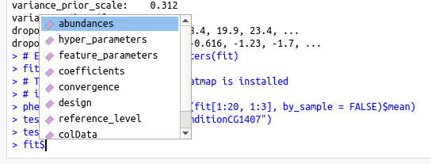

<style>
    body .main-container {
        max-width: 1024px;
    }
</style>

```{r, include = FALSE}
knitr::opts_chunk$set(
  collapse = TRUE,
  comment = "#>",
  out.width = "100%",
  error = TRUE
)
knitr::opts_knit$set(global.par = TRUE)
```

```{r, include=FALSE}
set.seed(1)
options(width = 100)
par(cex.lab=1.5, cex.axis=1.5, cex.main=1.5, cex.sub=1.5)
```

# proDA

<!-- badges: start -->
<!-- badges: end -->

The goal of `proDA` is to identify differentially abundant proteins in label-free
mass spectrometry data. The main challenge of this data are the many missing values.
The missing values don't occur randomly but especially at low intensities. This 
means that they cannot just be ignored. Existing methods have mostly focused on
replacing the missing values with some reasonable number ("imputation") and then
run classical methods. But imputation is problematic because it obscures the
amount of available information. Which in turn can lead to over-confident 
predictions.

`proDA` on the other hand does not impute missing values, but constructs a 
probabilistic dropout model. For each sample it fits a sigmoidal dropout 
curve. This information can then be used to infer means across samples and the
associated uncertainty, without the intermediate imputation step. `proDA`
supports full linear models with variance and location moderation.

For full details, please see our **preprint**:

Constantin Ahlmann-Eltze and Simon Anders: *proDA: Probabilistic Dropout Analysis for Identifying Differentially Abundant Proteins in Label-Free Mass Spectrometry*. [biorXiv 661496](http://www.biorxiv.org/content/10.1101/661496v1) (Jun 2019)

## Installation

proDA is implemented as an [R](https://cran.r-project.org/) package.

You can install it from [Bioconductor](https://www.bioconductor.org/) by typing 
the following commands into R:

```{r eval=FALSE}
if(!requireNamespace("BiocManager", quietly = TRUE))
    install.packages("BiocManager")
BiocManager::install("proDA")
```

To get the latest development version from
[GitHub](https://github.com/const-ae/proDA), you can use
the [`devtools`](https://github.com/r-lib/devtools) package:

```{r eval=FALSE}
# install.packages("devtools")
devtools::install_github("const-ae/proDA")
```

The pkgdown documentation for the package is available on
<https://const-ae.github.io/proDA/reference>.

---

In the following section, I will give a very brief overview on the main
functionality of the `proDA` package, aimed at experienced R users. 
New users are advised to skip this "quickstart" and to go directly
to section 1.3, where I give a complete walkthrough and explain in
detail, what steps are necessary for the analysis of label-free mass
spectrometry data.

## Quickstart

The three steps that are necessary to analyze the data are

1. Load the data (see vignette on loading MaxQuant output files)
2. Fit the probabilistic dropout model (`proDA()`)
3. Test in which proteins the coefficients of the model differ (`test_diff()`)

```{r quickstart}
# Load the package
library(proDA)
# Generate some dataset with known structure
syn_dataset <- generate_synthetic_data(n_proteins = 100, n_conditions = 2)

# The abundance matrix
syn_dataset$Y[1:5, ]

# Assignment of the samples to the two conditions
syn_dataset$groups

# Fit the probabilistic dropout model
fit <- proDA(syn_dataset$Y, design = syn_dataset$groups)

# Identify which proteins differ between Condition 1 and 2
test_diff(fit, `Condition_1` - `Condition_2`, sort_by = "pval", n_max = 5)
```

Other helpful functions for quality control are `median_normalization()` and 
`dist_approx()`.


## proDA Walkthrough

`proDA` is an R package that implements a powerful probabilistic dropout model
to identify differentially abundant proteins. The package was specifically designed 
for label-free mass spectrometry data and in particular how to handle the many
many missing values.

But all this is useless if you cannot load your data and get it into a shape that is useable.
In the next section, I will explain how to load the abundance matrix and bring it into
a useful form. The steps that I will go through are 

1. Load the `proteinGroups.txt` MaxQuant output table
2. Extract the intensity columns and create the abundance matrix
3. Replace the zeros with `NA`s and take the `log2()` of the data
4. Normalize the data using `median_normalization()`
5. Inspect sample structure with a heatmap of the distance matrix (`dist_approx()`)
6. Fit the probabilistic dropout model with `proDA()`
7. Identify differentially abundant proteins with `test_diff()`

### Load Data

I will now demonstrate how to load a MaxQuant output file. For more information
about other approaches for loading the data, please take a look at the vignette on loading
data.

MaxQuant is one of the most popular tools for handling raw MS data. It produces
a number of files. The important file that contains the protein intensities is
called `proteinGroups.txt`. It is a large table with detailed information about
the identification and quantification process for each protein group (which I will
from now on just call "protein").

This package comes with an example `proteinGroups.txt` file, located in the 
package folder. The file contains the reduced output from an experiment studying the different 
DHHCs in Drosophila melanogaster.

```{r}
system.file("extdata/proteinGroups.txt", package = "proDA", mustWork = TRUE)
```

In this example, I will use the base R functions to load the data, because 
they don't require any additional dependencies.

```{r}
# Load the table into memory
maxquant_protein_table <- read.delim(
    system.file("extdata/proteinGroups.txt", package = "proDA", mustWork = TRUE),
    stringsAsFactors = FALSE
)
```

As I have mentioned, the table contains a lot of information (359 columns!!), but we
are first of all interested in the columns which contain the measured intensities.

```{r}
# I use a regular expression (regex) to select the intensity columns
intensity_colnames <- grep("^LFQ\\.intensity\\.", colnames(maxquant_protein_table), value=TRUE)
head(intensity_colnames)


# Create the intensity matrix
abundance_matrix <- as.matrix(maxquant_protein_table[, intensity_colnames])
# Adapt column and row maxquant_protein_table
colnames(abundance_matrix) <- sub("^LFQ\\.intensity\\.", "", intensity_colnames)
rownames(abundance_matrix) <- maxquant_protein_table$Protein.IDs
# Print some rows of the matrix with short names so they fit on the screen
abundance_matrix[46:48, 1:6]
```

After extracting the bits from the table we most care about, we will have to modify it.

Firstly, MaxQuant codes missing values as `0`. This is misleading, because the actual
abundance probably was not zero, but just some value too small to be detected by the mass spectrometer.
Accordingly, I will replace all `0` with `NA`. 

Secondly, the raw intensity values have a linear mean-variance relation. This is undesirable, because 
a change of `x` units can be a large shift if the mean is small or irrelevant if the mean is large.
Luckily, to make the mean and variance independent, we can just `log` the intensities. Now a change
of `x` units is as significant for highly abundant proteins, as it is for low abundant ones.

```{r}
abundance_matrix[abundance_matrix == 0] <- NA
abundance_matrix <- log2(abundance_matrix)
abundance_matrix[46:48, 1:6]

```


### Quality Control

Quality control (QC) is essential for a successful bioinformatics analysis, because any dataset 
shows some unwanted variation or could even contain more serious error like for example a sample
swap.

Often we start with normalizing the data to remove potential
sample specific effects. But already this step is challenging, because the missing values cannot
easily be corrected for. Thus, a first helpful plot is to look how many missing values are in each
sample.

```{r qc-mis_barplot,  out.width="80%", fig.height=4, fig.align="center"}

barplot(colSums(is.na(abundance_matrix)),
        ylab = "# missing values",
        xlab = "Sample 1 to 36")
```

We can see that the number of missing values differs substantially between samples (between 30% and
90%) in this dataset. If we take a look at the intensity distribution for each sample, we see that
they differ substantially as well. 

```{r qc-raw_boxplot, out.width="80%", fig.height=4, fig.align="center"}
boxplot(abundance_matrix,
        ylab = "Intensity Distribution",
        xlab = "Sample 1 to 36")
```

Note that, the intensity distribution is shifted upwards for samples  which also have a large number
of missing values (for example the last one). This agrees with our idea that small values are
more likely to be missing. On the other hand, this also demonstrates why normalization methods
such as quantile normalization, which distort the data until all the distributions
are equal, are problematic. I will apply the more "conservative" median normalization, which 
ignores the  missing values and transforms the values so that the median difference between the 
sample and average across all other samples is zero.

```{r}
normalized_abundance_matrix <- median_normalization(abundance_matrix)
```

An important tool to identify sample swaps and outliers in the dataset is to look at the sample
distance matrix. It shows the distances of samples A to B, A to C, B to C and so on.

The base R `dist()` function can not handle input data that contains missing values, so we might be
tempted to just replace the missing values with some realistic numbers and calculate the distance 
on the 
completed dataset. But choosing a good replacement value is challenging and can also be misleading
because the samples with many missing values would be considered too close.

Instead `proDA` provides the `dist_approx()` function that takes either a fitted model (ie. the 
output from `proDA()`) or a simple matrix (for which it internally calls `proDA()`) and 
estimates the expected distance without imputing the missing values. In addition, it reports
the associated uncertainty with every estimate. The estimates for samples with many missing
values will be uncertain, allowing the data analyst to discount them.

```{r}
da <- dist_approx(normalized_abundance_matrix)
```


`dist_approx()` returns two elements the `mean` of the estimate and the associated `sd`.
In the next step I will plot the heatmap for three different conditions, adding the 95% confidence
interval as text to each cell. 

```{r sample_dist, out.width="60%", fig.align="center"}
# This chunk only works if pheatmap is installed
# install.packages("pheatmap")
sel <- c(1:3,  # CG1407
         7:9,  # CG59163
         22:24)# CG6618

plot_mat <- as.matrix(da$mean)[sel, sel]
# Remove diagonal elements, so that the colorscale is not distorted
plot_mat[diag(9) == 1] <- NA
# 95% conf interval is approx `sd * 1.96`
uncertainty <- matrix(paste0(" ± ",round(as.matrix(da$sd * 1.96)[sel, sel], 1)), nrow=9)
pheatmap::pheatmap(plot_mat, 
                   cluster_rows = FALSE, cluster_cols = FALSE,
                   display_numbers= uncertainty,
                   number_color = "black")
```


### Fit the Probabilistic Dropout Model

In the next step, we will fit the actual linear probabilistic dropout model to the normalized
data. But before we start, I will create a data.frame that contains some additional information on
each sample, in particular to which condition that sample belongs.

```{r}
# The best way to create this data.frame depends on the column naming scheme
sample_info_df <- data.frame(name = colnames(normalized_abundance_matrix),
                             stringsAsFactors = FALSE)
sample_info_df$condition <- substr(sample_info_df$name, 1, nchar(sample_info_df$name)  - 3)
sample_info_df$replicate <- as.numeric(
  substr(sample_info_df$name, nchar(sample_info_df$name)  - 1, 20)
)
sample_info_df
```


Now we can call the `proDA()` function to actually fit the model. We specify the `design` using
the formula notation, referencing the `condition` column in the `sample_info_df` data.frame that
we have just created. In addition, I specify that I want to use the `S2R` condition as the reference
because I know that it was the negative control and this way automatically all coefficients
measure how much each condition differs from the negative control.

```{r}
fit <- proDA(normalized_abundance_matrix, design = ~ condition, 
             col_data = sample_info_df, reference_level = "S2R")
fit
```

The `proDAFit` object prints a number of useful information about the convergence of the model,
the size of the dataset, the number of missing values, and the inferred hyper parameters.

To make it easy to find available methods on the `proDAFit` object, the `$`-operator is overloaded
and shows a list of possible functions:




```{r}
# Equivalent to feature_parameters(fit)
fit$feature_parameters
```

Internally the `proDAFit` object is implemented as a subclass of `SummarizedExperiment`.
This means it can be subsetted, which is for example useful for calculating the distance 
of a subset of proteins and samples.

```{r protein_dist, out.width="60%", fig.align="center"}
# This chunk only works if pheatmap is installed
# install.packages("pheatmap")
pheatmap::pheatmap(dist_approx(fit[1:20, 1:3], by_sample = FALSE)$mean)
```


### Identify Differential Abundance

Lastly, we will use a Wald test to identify in which proteins a coefficient is significantly different
from zero. The `test_diff()` function takes first the fit object produced by `proDA()` and a 
contrast argument. This can either be a string or an expression if we want to test more complex
combinations. For example `conditionCG1407 - (conditionCG6017 + conditionCG5880) / 2` would test
for the difference between CG1407 and the average of CG6017 and CG5880. 

Alternatively `test_diff()` also supports likelihood ratio F-tests. In that case instead of the `contrast`
argument specify the `reduced_model` argument.

```{r}
# Test which proteins differ between condition CG1407 and S2R
# S2R is the default contrast, because it was specified as the `reference_level`
test_res <- test_diff(fit, "conditionCG1407")
test_res
```


This walkthrough ends with the identification which proteins are differentially abundant. But for
a real dataset, now the actual analysis only just begins. A list of significant proteins is hardly
ever a publishable result, one often needs to make sense what the relevant underlying biological 
mechanisms are. But for this problem other tools are necessary, which depend on the precise 
question associated with the biological problem at hand.


# Session Info

```{r}
sessionInfo()
```


